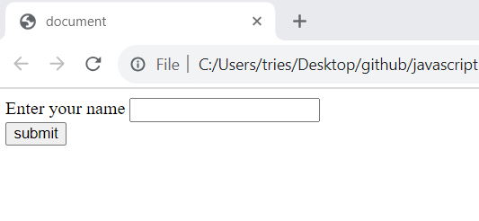
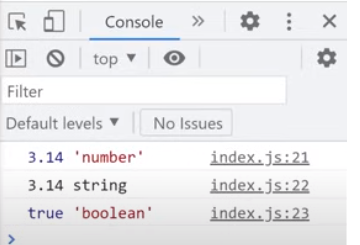
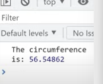
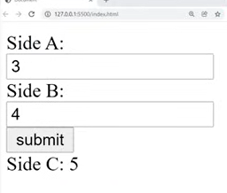

# javascript-fullcourse-of-8-hours

 
<b> <a href="https://www.youtube.com/watch?v=8dWL3wF_OMw" target="_blank"> Link to tutorial </a></b>
 

Date:-31/10/2023
 
Enlisted below things I learnt today. 👇
 

✮[1] variables ❎
 

✮[2] arithmetic expressions 🧮
 

✮[3]user input 🧮
 

 

✮[4] type conversion

 

Date:-01/12/2023
 
Enlisted below things I learnt today. 👇
 

[1] constant ⛔
 

 

[2] Math 🔣
 

[3] hypotenuse calc practice program 📐

