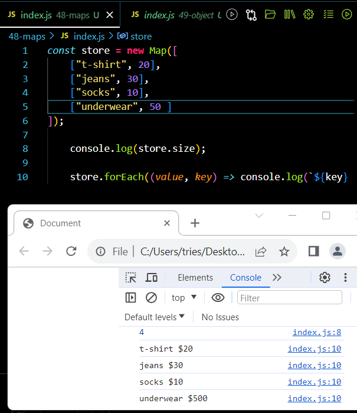
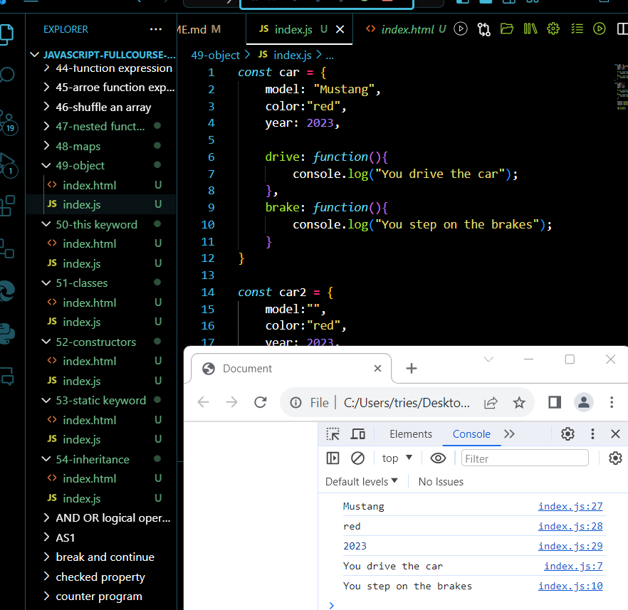
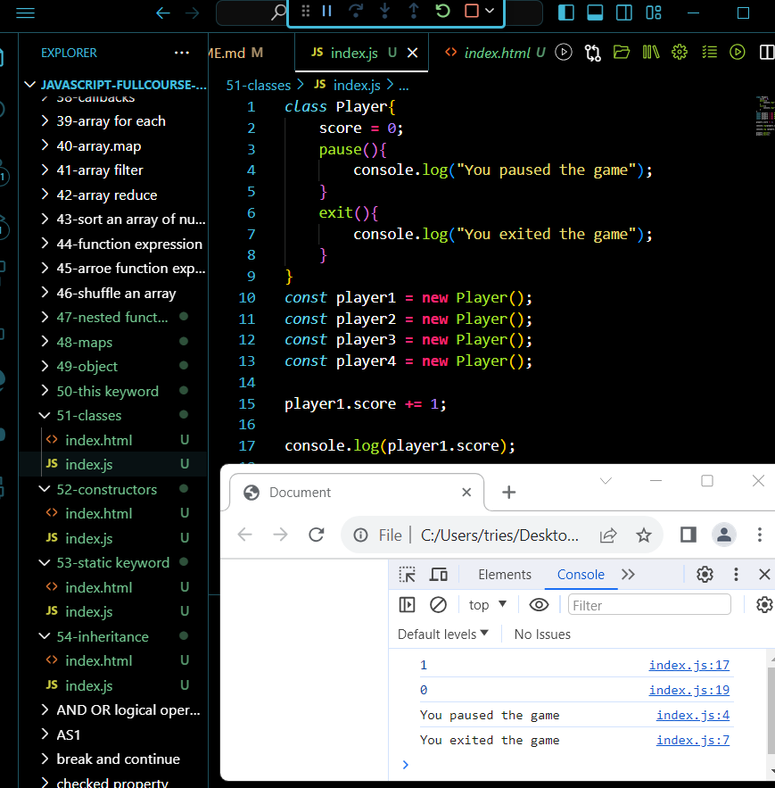
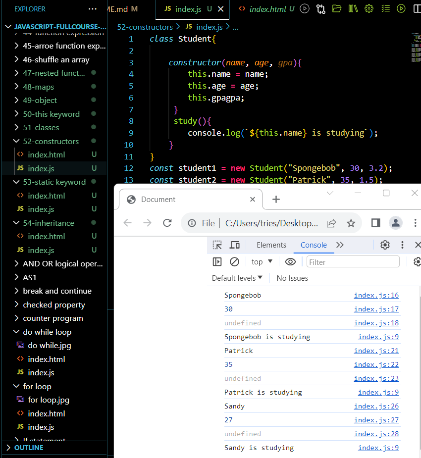
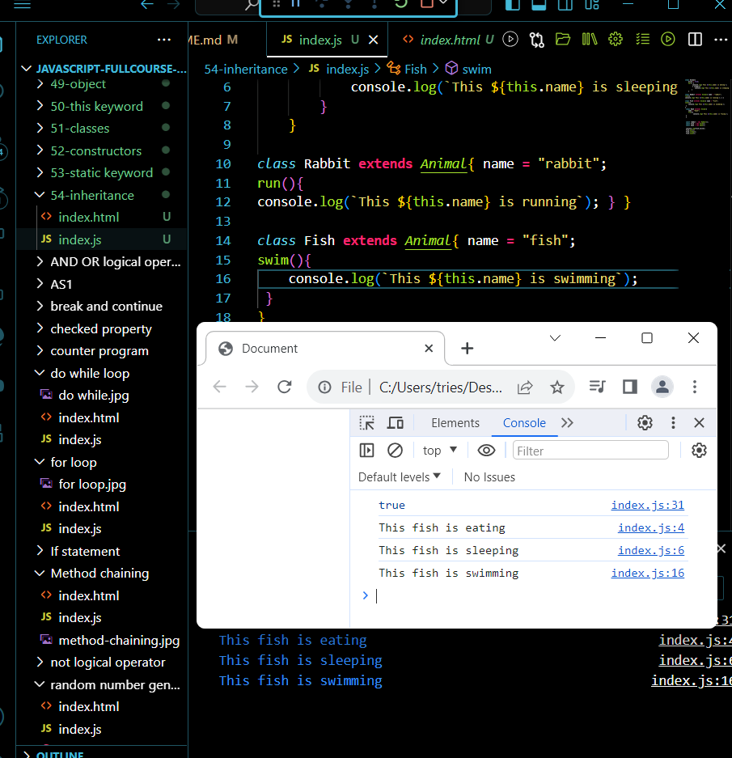
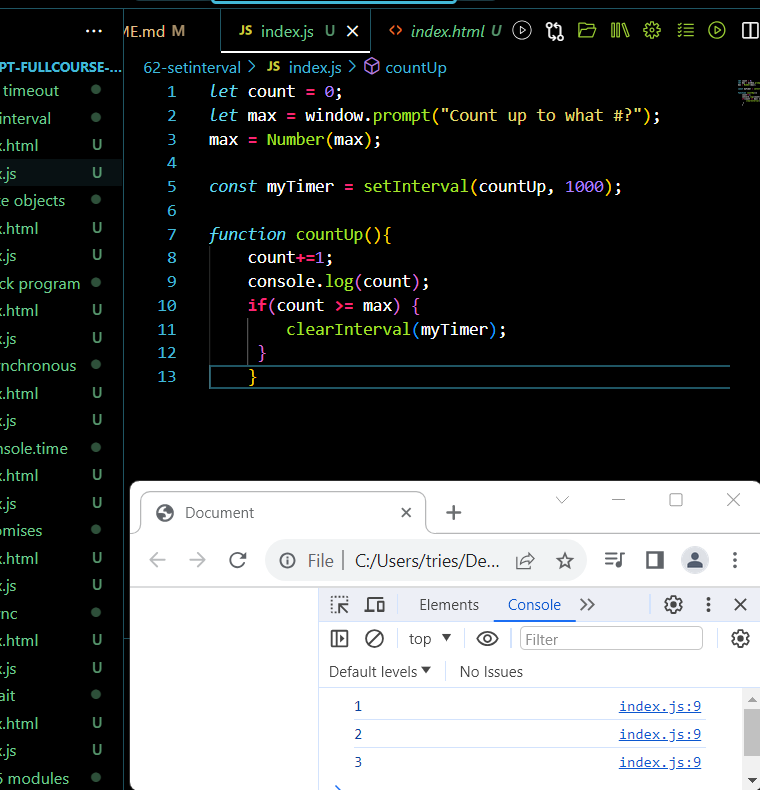

# javascript-fullcourse-of-8-hours

 
<b> <a href="https://www.youtube.com/watch?v=8dWL3wF_OMw" target="_blank"> Link to tutorial </a></b>
 

 
Date:-31/10/2023
 
Enlisted below are the  things I learnt today. 👇
 

✮[1] variables ❎
 

✮[2] arithmetic expressions 🧮
 

✮[3]user input 🧮
 

 

✮[4] type conversion

 

 

Date:-01/12/2023
 
Enlisted below are the things I learnt today. 👇
 

✮[1] constant ⛔
 

 

✮[2] Math 🔣
 

✮[3] hypotenuse calc practice program 📐

 
Date:-14/1/2024
 
Enlisted below are the things I learnt today. 👇
 

✮[1] Counter program #️⃣

 

https://github.com/trieshasonarkar1224/javascript-fullcourse-of-8-hours/assets/147965443/0d6a1c82-e5a1-4d14-ab7f-1631edf58556

 

✮[2] random number generator 🎲

 

https://github.com/trieshasonarkar1224/javascript-fullcourse-of-8-hours/assets/147965443/1ad875ef-5433-41ff-a545-ad3cedbfab99

 

✮[3] useful string methods 🧵
<b>

✮[4] string slicing ✂️
 

 

✮[5] method chaining ⛓️

✮[6] if statements ❔

 
Date:-15/1/2024
 
Enlisted below are the things I learnt today. 👇
 

✮[1] checked property ✔️

 

  

 ✮[2] switches 🔀

 

✮[3] AND OR logical operators && ||

 

✮[4] NOT logical operator ❕

 

✮[5]while loops 🔁
 

✮[6] do while loops 🔂
 

✮[7]  for loops 🔃
 

✮[8] break and continue statements 💔
 

 
Date:-16/1/2024
 
Enlisted below are the things I learnt today. 👇
 

✮[1]  nested loops ➿

  

 ✮[2] functions ☎️

 

✮[3] return statement 🔙

 

✮[4] ternary operator ❔

 

✮[5] var vs let 🥊
 

✮[6] template literals 💬

 

✮[7] format currency 💲
 

✮[8] number guessing game 🔢
 

https://github.com/trieshasonarkar1224/javascript-fullcourse-of-8-hours/assets/147965443/fec6abd4-60b3-4229-8a28-7d3e8fa4d565

 
Date:-17/1/2024
 
Enlisted below are the things I learnt today. 👇
 

✮[1] temperature conversion program 🌡️
 

https://github.com/trieshasonarkar1224/javascript-fullcourse-of-8-hours/assets/147965443/07d4ec73-1578-40b6-a831-fa09fd74d3ea

✮[2] arrays 🍎
 

✮[3]loop through an array ➰
 

✮[4] sort an array of strings 🗃️
 

✮[5] 2D arrays 🛒 
 

✮[6]spread operator 🖐️
 

✮[7]  rest parameters 💤
 

✮[8]  callbacks 🤙
 

 
Date:-18/1/2024
 
Enlisted below are the things I learnt today. 👇
 

✮[1]array.forEach() 🔚

✮[2]array.map

() ⚙️

✮[3]array.filter() 🗑️

✮[4] array.reduce() 🔁

✮[5] sort an array of numbers 📋 

✮[6]  function expressions 🤫

https://github.com/trieshasonarkar1224/javascript-fullcourse-of-8-hours/assets/147965443/5dae3e19-07d8-4336-a20a-e9904136319f

✮[7]arrow function expressions 🏹

✮[8]shuffle an array 🃏

 
Date:-22/1/2024
 
Enlisted below are the things I learnt today. 👇
 

✮[1] nested functions 🐣
 

 

✮[2] maps 🗺️

 

✮[3] objects 🚗
 

✮[4] this keyword 🔝
 

✮[5] classes 👨‍🏫
 

✮[6] constructors 👷
 

✮[7] static keyword ⚡
 

✮[8] inheritance 👪
 

 
Date:-22/1/2024
 
Enlisted below are the things I learnt today. 👇
 

✮[1] super keyword 🦸‍♂️
 

✮[2]getters & setters 🏎️
 

✮[3] objects as arguments 📫
 

✮[4] array of objects 📮
 

✮[5] anonymous objects 🎭
 

✮[6] error handling 🏤
 

✮[7] setTimeout() ⏰
 

✮[8]setInterval() ⏲️
 

 

✮[9] Date objects 📅
 

